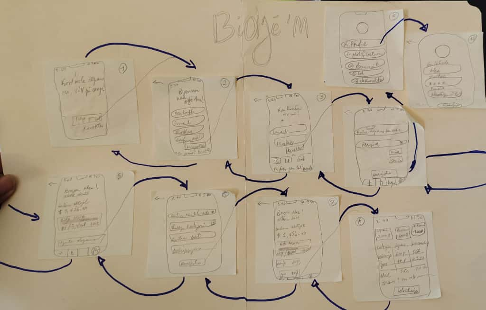

Group Members:
Marie Magdala Saintil
Jean Deniel Gedeon
Esther Lynce

App Ideas:
The application allows users to record their main sources of expenditure and income. 
The application helps users monitor their periodic expenses and track their income in relation to their spending.
An app that helps you find ways to get around the city.
Application allows you to set spending limits and well-defined goals.
Bonus: You receive an alert when your expenses exceed what was planned.

Final App Idea:
BidjèM : A budget management App.
Most people use their money without keeping track of small daily expenses, without setting spending limits, without planning their savings, and without identifying potential sources of spending. This app solves that problem. Just as we carry our phones with us everywhere, our budget manager is with us everywhere too.

User Stories:

Users  will be able to create an account to access the main page of the app, or login if they already have an account. also be able to login using a google or facebook profile.
Users will be able to record their income.
Users should be able to determine how much money they want to spend and save for the month or the week.
The user will be able to obtain a detailed report on all of their expenses.
Users should be able to add new expenses.

Maybe
Users should be able to edit their profile and add a picture. 
User should be able to have a color alert when the expense reach the limit sets
User can chose share the app directly to friend
Users can choose to share their experience from the app review. 

Design:

